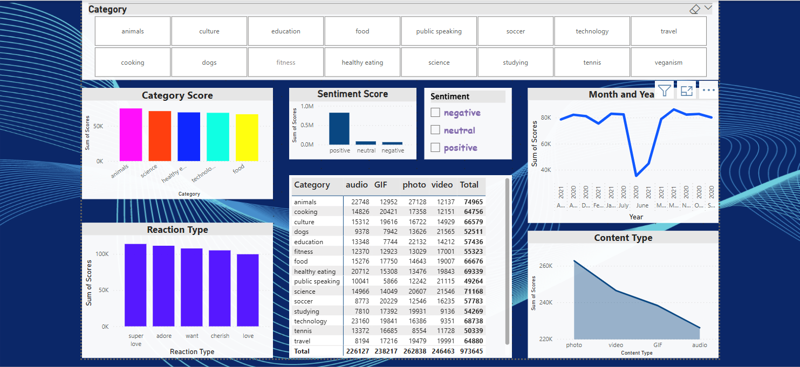

# Princewill-Elochukwu
<!--Section 1: Introduce your self-->
## ABOUT ME

Hello! I'm Princewill Elochukwu 🧑‍💻 — a data analyst, passionate about transforming data into actionable insights.
I bring cross-functional experience in sales, operations, finance, and customer service. Skilled in cybersecurity, web development, and cloud computing, with strong Excel and Power BI expertise.
I build secure, insight-driven solutions that help businesses grow and adapt intelligently.

<!--Mention your top/relevant skills here - core and soft skills-->
## WHAT I DO

I’m the founder of CHALA LOKAL INC LTD, where I offer analytical solutions across operations, finance, and business training.

**- ✅ Data Analytics Consulting.**
I provide in-depth analysis and tailored solutions to help you make data-driven decisions, optimize processes, and drive business growth. 

**- ✅ Transformation & Visualizations.**
I offer comprehensive training programs in data analysis, visualization, and data-driven decision-making. From beginner to advanced levels. 

<!--Section 2: List 3-4 key projects-->
## MY PORTFOLIO 

*A glimpse of some of the projects I've been working on.*

**Content Analytical insights of Social Buzz content media**

The rise of Social Buzz marks a shift in social media, where content—not users—drives engagement and defines virality.

## CONTACT DETAILS

*Let’s connect and see how we can make a difference together!*
<table>
  <tbody>
    <tr>
      <td>📧</td>
      <td><a href="mailto:elochukwuprincewill@gmail.com">elochukwuprincewill@gmail.com</a></td>
    </tr>
    <tr>
      <td>📞</td>
      <td>(234) 9064382758</td>
    </tr>
    <tr>
      <td>📍</td>
      <td>Lagos, Nigeria</td>
    </tr>
    <tr>
      <td>🌐</td>
      <td><a href="https://linkedin.com/Elochukwu-Princewill">LinkedIn</a></td>
    </tr>
  </tbody>
</table>

   

